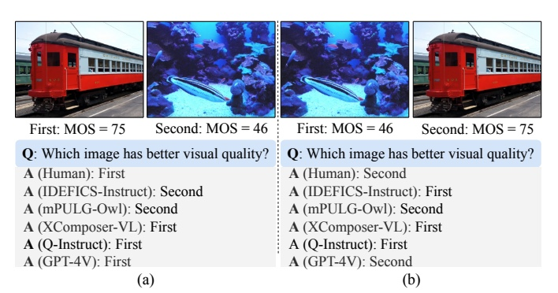

<div align="center">
  <h1>2AFC Prompting of Large Multimodal Models for Image Quality Assessment</h1> 
    
  <div>
    <a href="https://h4nwei.github.io/" target="_blank">Hanwei Zhu</a><sup>1</sup><sup>*</sup>,
      <a href="https://xiangjiesui.github.io/" target="_blank">Xiangjie Sui</a><sup>2</sup><sup>*</sup>,
      <a href="https://scholar.google.com/citations?hl=en&user=w_WL27oAAAAJ&view_op=list_works" target="_blank">Baoliang Chen</a><sup>3</sup>,
      <a href="https://scholar.google.com/citations?user=fJNsU58AAAAJ&hl=zh-CN" target="_blank">Xuelin Liu</a><sup>4</sup>,
        <a href="https://scholars.cityu.edu.hk/en/persons/peilin-chen(d50956c3-fc01-4282-a3e8-3060e6ae69f3).html" target="_blank">Peilin Chen</a><sup>1</sup>,
      <a href="http://sim.jxufe.cn/JDMKL/ymfang_EN.html/" target="_blank">Yuming Fang</a><sup>4</sup>,
      <a href="https://www.cs.cityu.edu.hk/~shiqwang/" target="_blank">Shiqi Wang</a><sup>1</sup><sup>#</sup>
  </div>
    
  <div>
  <sup>1</sup>City University of Hong Kong <sup>2</sup>City University of Macau, <sup>3</sup>South China Normal University, 
  </div> 
    <div>
  <sup>4</sup>Jiangxi University of Finance and Economics
       </div>   
<div>
<sup>*</sup>Equal contribution.  <sup>#</sup>Corresponding author. 
   </div>

  <div>
  <a href="https://arxiv.org/abs/2402.01162" target="_blank">Paper</a>
</div>
    
<p align="center">
    
</p>
</div>


> *While abundant research has been conducted on improving high-level visual understanding and reasoning capabilities of large multimodal models~(LMMs), their image quality assessment (IQA) ability has been relatively under-explored. Here we take initial steps towards this goal by employing the two-alternative forced choice (2AFC)  prompting, as 2AFC is widely regarded as the most reliable way of collecting human opinions of visual quality. Subsequently, the global quality score of each image estimated by a particular LMM can be efficiently aggregated using the maximum a posteriori estimation. Meanwhile, we introduce three evaluation criteria: consistency, accuracy, and correlation, to provide comprehensive quantifications and deeper insights into the IQA capability of five LMMs. Extensive experiments show that existing LMMs exhibit remarkable IQA ability on coarse-grained quality comparison, but there is room for improvement on fine-grained quality discrimination. The proposed dataset sheds light on the future development of IQA models based on LMMs.* 


## 💫 Sample Images
We assess three open-source and one close-source LMMs on both coarse-grained and fine-grained scenarios. The selected images contain in the corresponding `JSON` files.

**Coarse-grained scenario** (`data/Coarse_grained_mixed.json`): 
- Synthtic distortion: [CSIQ](http://vision.eng.shizuoka.ac.jp/mod/page/view.php?id=23), [KADID-10k](https://database.mmsp-kn.de/kadid-10k-database.html)
, [MM21](https://github.com/sherlockyy/LICQA), [KADIS-700](https://database.mmsp-kn.de/kadid-10k-database.html)
- Realistic distortion:  [LIVE Challenge](https://live.ece.utexas.edu/research/ChallengeDB/index.html), [KonIQ-10k](https://database.mmsp-kn.de/koniq-10k-database.html),  [SPAQ](https://github.com/h4nwei/SPAQ),  [SQAD](https://github.com/aiff22/SQAD)


**Fine-grained scenario**: 
- Synthtic distortion (`Fine_grained_CSIQ_levels.json` and `Fine_grained_CSIQ_types.json`): [CSIQ](http://vision.eng.shizuoka.ac.jp/mod/page/view.php?id=23)
- Realistic distortion (`data/Fine_graind_SPAQ.json`): [SPAQ](https://github.com/h4nwei/SPAQ)


## :hammer_and_wrench: Quick Inference
Here is an example.
```
python main.py --data_dir path/IQA_datasets --stage_name Fine_grain_SPAQ.json --model_name ChatGPT
```

## BibTeX
```
@article{zhu20242afc,
  title={2AFC Prompting of Large Multimodal Models for Image Quality Assessment},
  author={Zhu, Hanwei and Sui, Xiangjie and Chen, Baoliang and Liu, Xuelin and Fang, Yuming and Wang, Shiqi},
  journal={IEEE Transactions on Circuits and Systems for Video Technology},
  year={2024}
}
```

## Personal Acknowledgement
I would like to thank [Kede Ma](https://kedema.org/) for his insightful discussions and diligent efforts in revising the paper.

## 📧 Contact
If you have any question, please contact `hanwei.zhu@my.cityu.edu.hk`.